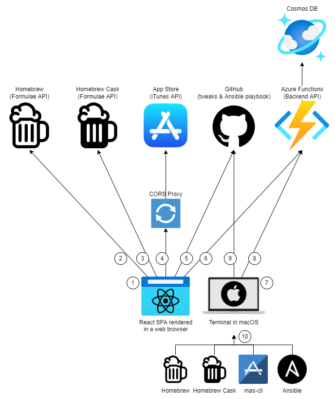

# BrewMyMac

[](https://github.com/ayltai/BrewMyMac/actions)
[](https://sonarcloud.io/dashboard?id=ayltai_BrewMyMac)
[](https://sonarcloud.io/dashboard?id=ayltai_BrewMyMac)


Possibly the coolest way to install apps and customize your Mac!

## Getting started

Try it: [https://brewmymac.sh](https://brewmymac.sh)

## Supported package repositories

* [Homebrew](https://brew.sh): The missing package manager for macOS
* [Homebrew Cask](https://formulae.brew.sh/cask/): An extension to [Homebrew](https://brew.sh) that allows you to install macOS applications
* [App Store](https://www.apple.com/app-store/): A macOS app store platform maintained by Apple Inc

## Supported macOS tweaks

* [macOS tweaks](https://github.com/ayltai/ansible-macOS-tweaks): A collection of nearly 50 macOS customizations

## Running locally

You need [Node.js](https://nodejs.org) and [npm](https://www.npmjs.com) installed on your machine.

1. Install dependencies
   ```bash
   npm i --legacy-peer-deps
   ```
2. Change the homepage URL in `package.json` to `.`
3. This app uses [Google Analytics](https://analytics.google.com) to track usage. You can change the GTAG ID to your own by setting the `REACT_APP_GA_TAG` environment variable.
4. Start the development server
   ```bash
   npm start
   ```
5. Open [http://localhost:3000](http://localhost:3000) with your browser

## Building from source

You need [Node.js](https://nodejs.org) and [npm](https://www.npmjs.com) installed on your machine.

1. Install dependencies
   ```bash
   npm i --legacy-peer-deps
   ```
2. Build the app
   ```bash
   npm run build
   ```
3. The built app will be in the `build` folder

## Deploying your own instance

Apart from changing the values in steps 2 and 3 in the [Running locally](#running-locally) section, you will need to create your own API for saving and retrieving sessions.

A session is a generated Shell script that contains the list of apps to be installed and tweaks to be applied and it is uniquely identified by its ID. The minimal data structure of a session is as follows:

```json
{
   "sessionId": "string",
   "script": "string"
}
```

This project uses [Xano](https://www.xano.com) as the backend service which provides persistent data storage and RESTful APIs. You can use any other service that provides similar functionality. If you do that, you need to change the URLs in `src/api/session.ts` and `src/screens/SessionDetail.tsx`.

## Architecture



1. The frontend is a [React](https://reactjs.org) app hosted on [GitHub Pages](https://pages.github.com). This project does not involve any backend service implementation.
2. The frontend app fetches a list of available apps from [Homebrew](https://brew.sh) via its [Formulae API](https://formulae.brew.sh/api/formula.json).
3. The frontend app fetches a list of available apps from [Homebrew Cask](https://brew.sh) via its [Formulae API](https://formulae.brew.sh/api/cask.json).
4. The frontend app searches for apps in Apple App Store via a public [CORS proxy](https://github.com/LeandroBerlin/itunes-search).
5. The frontend app fetches a list of available macOS tweaks from a [GitHub repository](https://github.com/ayltai/ansible-macos-tweaks).
6. When the user is ready to install apps and apply tweaks, the frontend app generates a shell script and stores it in [Xano](https://www.xano.com) which is a no-code database. A link to download the shell script is generated and a single-line command is displayed to the user.
7. The user opens Terminal in macOS.
8. The user runs the single-line command that downloads the shell script from [Xano](https://www.xano.com).
9. The shell script downloads an [Ansible](https://www.ansible.com) playbook for macOS tweaks from GitHub.
10. The shell script installs apps using [Homebrew](https://brew.sh) and [mas-cli](https://github.com/mas-cli/mas), and applies macOS tweaks using [Ansible](https://www.ansible.com).

## License

BrewMyMac is open source software released under [MIT](LICENSE).
